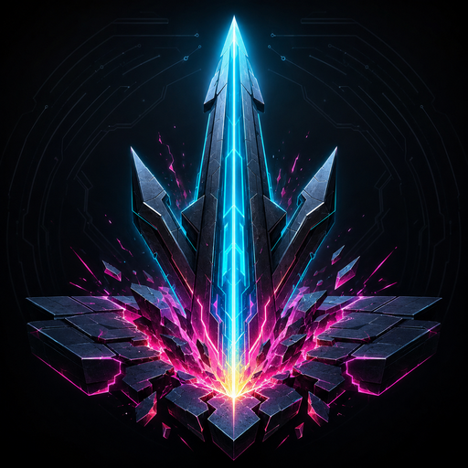
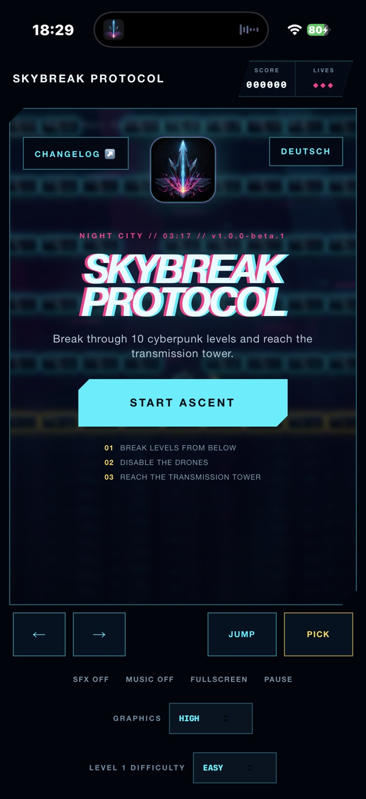
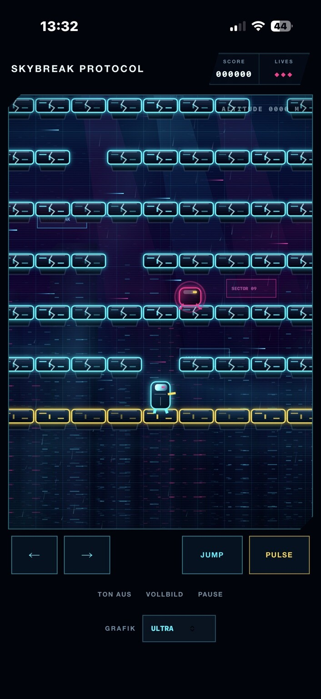
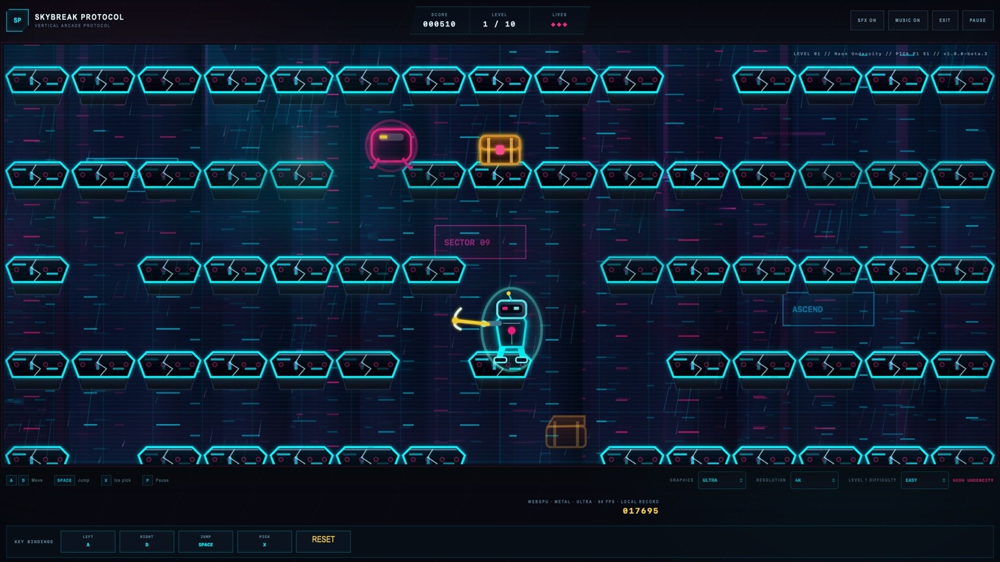
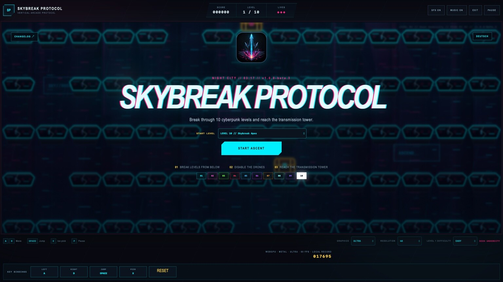

<p align="center">
  
</p>

<p align="center"><strong>Deutsch</strong> · <a href="README.md">English</a></p>

# Skybreak Protocol

**Aktuelle Version:** `v1.0.0-beta.4` · [Ausführlicher Changelog](docs/releases/1.0.0-beta.4.md) · [Alle Changelogs](CHANGELOG.md)

Ein eigenständiges vertikales Cyberpunk-Arcade-Spiel für moderne Desktop- und Mobilbrowser. Kämpfe dich durch zehn optisch eigenständige Level nach oben, durchbrich Plattformen von unten, weiche Drohnen und fallenden Gefahren aus und erreiche den Sendeturm über der Megacity. Jedes Level besitzt eine eigene Cyberpunk-Farbwelt, animierte Kulisse, Effekte und separat wählbare Schwierigkeit.

> Skybreak Protocol verwendet keine Grafiken, Musik, Figuren oder Quelltexte von Nintendo oder Ice Climber. Es handelt sich um eine eigenständige Neuinterpretation des klassischen vertikalen Arcade-Spielprinzips.

Der geprüfte Umgang mit Daten ist im [Datenschutzbericht](DATENSCHUTZ.md) und im [English Privacy Report](PRIVACY.md) dokumentiert.

## Spielen

- **GitHub Pages:** <https://schrotty74.github.io/Skybreak-Protocol/>
- **Deutsch:** <https://schrotty74.github.io/Skybreak-Protocol/de/>

Die Web-App funktioniert ohne Installation. Auf iPhone oder iPad kann sie in Safari über **Teilen → Zum Home-Bildschirm** als App-Symbol abgelegt werden. Unter Android steht die entsprechende Funktion im Browsermenü zur Verfügung.

Die aktuelle Version wird im Spiel angezeigt. Beim Start prüft Skybreak Protocol einmal die öffentlichen GitHub-Releases und zeigt einen Hinweis an, wenn eine neuere Beta- oder Final-Version verfügbar ist.

**Offline spielen:** Das versionierte ZIP steht beim [GitHub-Release](https://github.com/Schrotty74/Skybreak-Protocol/releases/tag/v1.0.0-beta.4) unter **Assets** bereit. Nach dem Entpacken den passenden Starter für macOS, Windows oder Linux öffnen. Alle zehn Musikstücke sind enthalten; nur die optionale Update-Prüfung benötigt Internet.

## Handbuch

- [Deutsches PDF-Handbuch](docs/manual/Skybreak-Protocol-Handbuch-DE.pdf) - Spielprinzip, Steuerung, alle Buttons, zehn Level, Power-ups und Cheat-Codes
- [English PDF manual](docs/manual/Skybreak-Protocol-Manual-EN.pdf)

## Handy-Screenshots

<p align="center">
  <a href="docs/screenshots/mobile-start.jpeg?raw=1"></a>
  &nbsp;&nbsp;
  <a href="docs/screenshots/mobile-gameplay.jpeg?raw=1"></a>
</p>

<p align="center"><em>Eine Vorschau anklicken, um das Bild in voller Größe zu öffnen.</em></p>

## Desktop-Screenshots

<p align="center">
  <a href="docs/screenshots/desktop-gameplay-ultra.jpeg?raw=1"></a>
  &nbsp;&nbsp;
  <a href="docs/screenshots/desktop-start-ultra.jpeg?raw=1"></a>
</p>

<p align="center"><em>Eine Vorschau anklicken, um das Bild in voller Größe zu öffnen.</em></p>

## Spielprinzip

- Durch zehn zunehmend schwierigere Cyberpunk-Level aufsteigen
- Jedes Level ist ein vollständiger Aufstieg über 15 Etagen mit eigener animierter Umgebung, Plattformmaterial, Wächterdrohne und Soundtrack
- Plattformmodule von unten durchbrechen
- Gegner und nahe Plattformmodule mit dem Eispickel des Roboters angreifen
- Truhen passend zur Schwierigkeit: auf Leicht dauerhaft alle zwei bis drei Etagen, auf Mittel ab der Hälfte zeitlich begrenzt und auf Schwer erst ab zwei Dritteln mit schnellen Positionswechseln – auch unterhalb des Spielers
- Wächterdrohne ausschalten, den nächsten Sektor als Vorschau sehen und danach Kraft oder Design des Eispickels verbessern
- Sichtbare Roboterschäden, Sensorflackern und Funken bei verlorenen Leben erleben
- Erreichte Level dauerhaft lokal freischalten und nach einem Lauf direkt als neues Startlevel auswählen
- Lücken, fallenden Energiesplittern und Patrouillendrohnen ausweichen
- Punkte sammeln, Leben erhalten und den lokalen Highscore verbessern

## Steuerung

| Aktion | Tastatur | Mobilgerät |
|---|---|---|
| Bewegen | Standard `A` / `D`, frei belegbar | Linke und rechte Bildschirmtaste |
| Springen | Standard `Leertaste`, frei belegbar | `JUMP` |
| Eispickel | Standard `X`, frei belegbar | `PICK` |
| Pause | `P` oder `Esc` | `PAUSE` |
| Vollbild | Schaltfläche `FULLSCREEN` | natives Vollbild oder immersiver Safari-Fallback |

Am Desktop befindet sich unter dem Spiel die **Tastenbelegung**. Eine Aktion anklicken und anschließend die gewünschte Taste drücken. Bereits verwendete Tasten werden automatisch getauscht; **Standard** stellt `A`, `D`, `Leertaste` und `X` wieder her.

## Roboter und Eispickel-Upgrades

Die Spielfigur ist ein kompakter Cyberpunk-Kletterroboter mit getrennten mechanischen Gliedmaßen, leuchtenden Sensoren, Antenne, animierten Gelenken und einem ständig sichtbaren Eispickel. Bleibt der Roboter stehen, begutachtet und dreht er spielerisch sein Werkzeug, statt unbewegt zu bleiben.

Der Eispickel greift Drohnen an und zerstört beschädigte Plattformmodule vor dem Roboter. Beim ersten Eintritt in Level 2 bis 10 pausiert das Spiel kurz und bietet jeweils ein Upgrade an:

- **Kraft:** erhöht die Reichweite und zerstört schrittweise mehr benachbarte Plattformmodule mit einem Schlag
- **Design:** verändert Neonfarbe, Kopfgeometrie und Leuchtstärke des Eispickels

Die Upgrades gelten für den aktuellen Durchlauf und werden als `P`- und `S`-Werte in der Levelanzeige dargestellt.

## Eigener Techno-Soundtrack

Der Startbildschirm und jedes Level besitzen einen eigenen Cyberpunk-Techno-Track. Die Musik startet nach der ersten Berührung oder Taste, wechselt automatisch mit einer kurzen Überblendung, läuft im Level als Schleife und lässt sich unabhängig von den Soundeffekten ein- und ausschalten.

| Level | Track | BPM | Anhören / Download |
|---|---|---:|---|
| 1 + Start | Neon Undercity | 126 | [MP3](https://schrotty74.github.io/Skybreak-Protocol/audio/level-01-neon-undercity.mp3) |
| 2 | Chrome Bazaar | 128 | [MP3](https://schrotty74.github.io/Skybreak-Protocol/audio/level-02-chrome-bazaar.mp3) |
| 3 | Toxic Transit | 130 | [MP3](https://schrotty74.github.io/Skybreak-Protocol/audio/level-03-toxic-transit.mp3) |
| 4 | Crimson Firewall | 132 | [MP3](https://schrotty74.github.io/Skybreak-Protocol/audio/level-04-crimson-firewall.mp3) |
| 5 | Azure Data Sea | 124 | [MP3](https://schrotty74.github.io/Skybreak-Protocol/audio/level-05-azure-data-sea.mp3) |
| 6 | Violet Reactor | 134 | [MP3](https://schrotty74.github.io/Skybreak-Protocol/audio/level-06-violet-reactor.mp3) |
| 7 | Solar Megagrid | 136 | [MP3](https://schrotty74.github.io/Skybreak-Protocol/audio/level-07-solar-megagrid.mp3) |
| 8 | Ghost Network | 128 | [MP3](https://schrotty74.github.io/Skybreak-Protocol/audio/level-08-ghost-network.mp3) |
| 9 | Quantum Rift | 138 | [MP3](https://schrotty74.github.io/Skybreak-Protocol/audio/level-09-quantum-rift.mp3) |
| 10 | Skybreak Apex | 142 | [MP3](https://schrotty74.github.io/Skybreak-Protocol/audio/level-10-skybreak-apex.mp3) |

## Grafikqualität

Die gewählte Stufe wird lokal auf dem Gerät gespeichert.

| Stufe | Ziel | Effekte |
|---|---|---|
| Niedrig | ältere oder warme Mobilgeräte | 30 FPS, reduzierte Auflösung, WebGL-Effekte aus, wenig Regen und Nebel |
| Mittel | empfohlene Smartphone-Einstellung | 40 FPS, WebGL-Nebel, reduzierte Partikel und Parallaxe |
| Hoch | leistungsfähige Geräte | bis 60 FPS, hohe Auflösung und erweiterte Effekte |
| Ultra | aktuelle Desktop- und Mobil-GPUs | vollständiges WebGPU-Post-Processing, optionales Mobile Ultra bis 120 FPS, F16-Shader, GPU-Instancing sowie adaptive Auflösung und Effekte; WebGL2-Fallback |

> [!WARNING]
> **Mobile Ultra kann das Smartphone sehr stark belasten. Das Gerät kann dabei deutlich bis sehr warm werden und der Akkuverbrauch steigt. Bei hohen Umgebungstemperaturen oder direkter Sonneneinstrahlung wird von Mobile Ultra abgeraten. Für längeres Spielen wird „Mittel“ empfohlen. Bei starker Erwärmung sofort auf „Niedrig“ wechseln oder das Spiel pausieren.**

### Was Ultra verändert

Ultra ergänzt eine vollständige WebGPU-Pipeline und fordert die **Hochleistungs-GPU** des Browsers an. Unter macOS wird WebGPU vom Browser auf Metal abgebildet; auf aktuellen NVIDIA- und AMD-Systemen kommt die native GPU-Anbindung des Browsers zum Einsatz. Gegenüber Hoch bietet Ultra dichteren mehrschichtigen Nebel und Regen, Energiegitter, animierte Lichtstrahlen, stärkeren Bloom, bildschirmbasierte Neonreflexionen, chromatische Bearbeitung, Tone-Mapping und eine höhere Auflösung bis 4K.

Plattformen, Gegner, Trümmer, Spielpartikel und Regen erhalten GPU-instanzierte Verstärkungsebenen. Ein eigener Web Worker berechnet atmosphärische Instanzen und wertet die Bildzeiten außerhalb des Hauptthreads aus. Auf geeigneten Desktop-Bildschirmen wählt der Renderer automatisch 60, 90 oder bis zu 120 FPS und passt die Auflösung zwischen 62 und 100 Prozent an.

Wenn verfügbar, verwendet Ultra effiziente 16-Bit-Shader-Berechnungen für das Tone-Mapping und andernfalls den kompatiblen 32-Bit-Pfad. **Mobile Ultra** lässt sich vom schonenderen Standard mit 60 FPS auf adaptive 60/90/120 FPS für Bildschirme mit hoher Bildrate umstellen. Browser stellen keinen Temperatursensor bereit. Deshalb erkennt eine lokale Leistungssteuerung anhaltend schlechtere Bildzeiten als Hinweis auf Wärme- oder Leistungsdrosselung und reduziert stufenweise Bloom-Abtastungen, Reflexionen, Post-Processing und Renderauflösung. Messwerte verlassen das Gerät nicht.

Bei fehlender WebGPU-Unterstützung oder einem Softwareadapter werden automatisch der vorhandene WebGL2- und Canvas-Renderer verwendet.

### iPhone Pro und Hardware-Raytracing

Mit dem iPhone 15 Pro führte Apple eine 6-Core-GPU mit hardwarebeschleunigtem Raytracing ein. Das iPhone 17 Pro verwendet den A19 Pro mit 6-Core-GPU, hardwarebeschleunigtem Raytracing und verbesserter dauerhafter Spieleleistung. Skybreak Protocol profitiert bereits über Safaris WebGPU-zu-Metal-Anbindung davon: Ultra verwendet auf unterstützten iPhones vollständiges Post-Processing, GPU-Instancing, Worker-gestützte Berechnungen und adaptive Auflösung. [Apple: iPhone 15 Pro](https://www.apple.com/de/newsroom/2023/09/apple-unveils-iphone-15-pro-and-iphone-15-pro-max/) · [Apple: technische Daten des iPhone 17 Pro](https://www.apple.com/iphone-17-pro/specs/)

Die Hardware-Raytracing-Kerne können von dieser Web-App derzeit nicht direkt angesprochen werden, weil Raytracing nicht zum Funktionsumfang der Browser-WebGPU-Schnittstelle gehört. Ultra verwendet deshalb bildschirmbasierte Neonreflexionen statt Hardware-Raytracing. Auf einem Pro-iPhone mit hoher Bildrate kann Mobile Ultra optional bis zu 120 FPS anstreben; bei anhaltendem Leistungseinbruch wird auf 90/60 FPS und reduziertes Post-Processing zurückgeschaltet. [Aktuelle WebGPU-Funktionsliste](https://gpuweb.github.io/types/types/GPUFeatureName.html)

## Grafische Effekte

- WebGPU-Ultra-Shader für mehrschichtigen Neonnebel, dichteren Regen, Energiegitter, Lichtstrahlen und atmosphärischen Bloom
- vollständiger Bloom, bildschirmbasierte Neonreflexionen, chromatische Bearbeitung, Tone-Mapping und Vignette
- GPU-instanzierte Verstärkungsebenen für Plattformen, Gegner, Trümmer, Spielpartikel und Regen
- Web Worker für atmosphärische Instanzberechnung und adaptive Steuerung mit 60/90/120 FPS
- automatische Nutzung von Metal unter macOS und der nativen Browser-GPU-Anbindung auf aktuellen NVIDIA-/AMD-Systemen
- adaptive Ultra-Effektauflösung bis 4K mit WebGL2-Fallback
- bedingtes F16-WebGPU-Tone-Mapping mit automatischem F32-Fallback
- optionales Mobile Ultra bis 120 FPS mit leistungsbasiertem Wärmeschutz
- mehrstufige Parallax-Megacity mit beleuchteten Fenstern
- volumetrische Suchscheinwerfer und dynamische Lichtkegel
- holografische Werbeflächen und fliegender Stadtverkehr
- animierter Neonregen, Scanlines und subtile chromatische Effekte
- dreidimensional wirkende Plattformmodule mit Metall-, Glas- und Energietexturen
- dynamische Schatten, Bloom, Bewegungs- und Eispickel-Spuren
- Partikel, Trümmer, Einschlagseffekte und Bildschirmerschütterung
- adaptive Renderauflösung bis 4K
- animierter Cyberpunk-Roboter mit aufrüstbarem Eispickel und Leerlaufanimation zum Begutachten und Drehen des Werkzeugs

## Technik

- React 19 und TypeScript
- Vite 8
- Canvas 2D mit WebGPU-Ultra-Effektebene und WebGL2-kompatiblem Fallback
- Modul-Web-Worker für Ultra-Instanzsimulation und Leistungssteuerung
- Web Audio API für synthetisierte Arcade-Sounds
- Soundtrack-Wiedergabe aus eigenen MP3-Dateien mit automatischer Level-Überblendung
- öffentliche GitHub-Release-Prüfung für neue Beta- und Final-Versionen
- Pointer Events für Maus, Touch und Stift
- Local Storage für Highscore, Grafikstufe, Schwierigkeiten, Level-Freischaltung und Desktop-Tastenbelegung
- automatische GitHub-Pages-Bereitstellung über GitHub Actions
- CSS-basierter immersiver Vollbild-Fallback für Safari auf dem iPhone

## Zehn Level-Umgebungen

| Level | Umgebung | Farbwelt und Effekt |
|---:|---|---|
| 1 | Neon Undercity | cyan- und magentafarbene Unterstadt mit bewegten Neon-Scanbalken |
| 2 | Chrome Bazaar | Pink-, Mint- und Chromtöne mit animierten Hologrammrahmen |
| 3 | Toxic Transit | giftgrüne Infrastruktur mit aufsteigenden Energieblasen |
| 4 | Crimson Firewall | rot-orange Sicherheitszone mit pulsierenden Firewall-Säulen |
| 5 | Azure Data Sea | tiefblauer Datenbezirk mit fließenden digitalen Wellen |
| 6 | Violet Reactor | violetter Energiekern mit expandierenden Reaktorringen |
| 7 | Solar Megagrid | bernsteinrotes Energienetz mit strahlendem Sonnenleuchten |
| 8 | Ghost Network | blass-cyanfarbene Netzruinen mit geisterhaften Lichtspuren |
| 9 | Quantum Rift | violett-blaue Dimensionszone mit bewegtem Quantenpfad |
| 10 | Skybreak Apex | leuchtend-cyanfarbener Gipfel mit rotierenden Sendestrahlen |

Gegnerdichte und Umgebungsgefahren steigen von Level zu Level. Für jedes Level kann unabhängig **Leicht**, **Mittel** oder **Schwer** gewählt werden; die Einstellung beeinflusst Gegnergeschwindigkeit, Häufigkeit und Geschwindigkeit der Gefahren sowie den Punktemultiplikator. Die Auswahl bleibt ausschließlich lokal im Browser des Geräts gespeichert.

## Lokale Entwicklung

```bash
npm install
npm run dev
```

Produktions-Build:

```bash
npm run build
```

Jede Beta- und Final-Version benötigt eine eigene ausführliche Datei unter `docs/releases/`. Der Ablauf ist im [Release-Workflow](docs/RELEASE_WORKFLOW.md) beschrieben.

## Hinweise zur Geräteleistung

Ultra kann Smartphones stark belasten und zu höherer Temperatur sowie schnellerem Akkuverbrauch führen. Für iPhones und Android-Geräte ist **Mittel** die empfohlene Einstellung. Bei deutlicher Erwärmung sollte **Niedrig** verwendet werden.

## Lizenz

Der Quelltext steht unter der [MIT-Lizenz](LICENSE). Der Name **Skybreak Protocol**, Logos, App-Symbole, Screenshots, Werbegrafiken und visuelle Kunstwerke sind davon ausgenommen; siehe [Asset and Brand License](ASSET_LICENSE.md).
